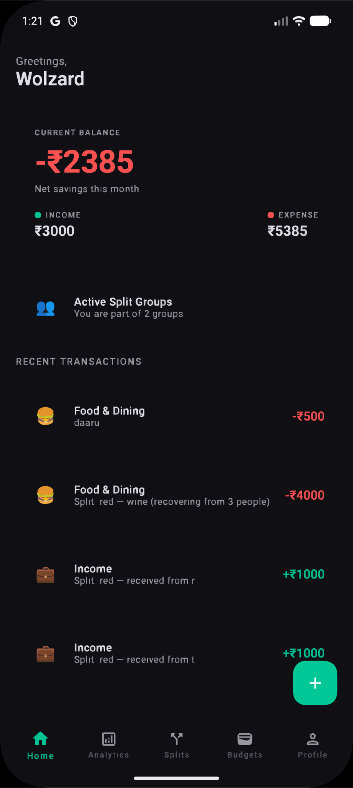
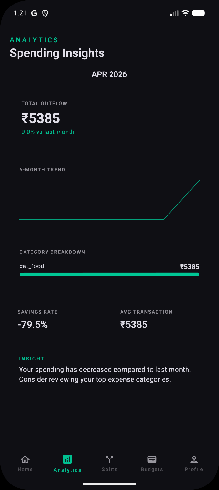
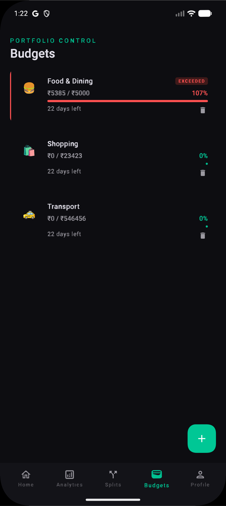
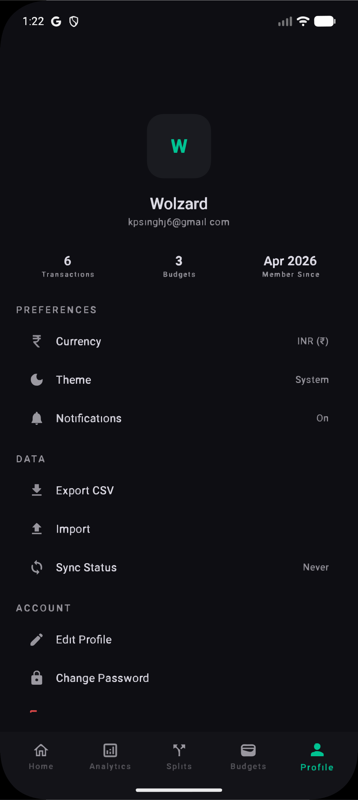

# Obsidian Ledger

<p align="center">
  
</p>

<p align="center">
  Offline-first personal finance manager built with Kotlin Multiplatform.
</p>

<p align="center">
  
  
  
  
  
</p>

## Overview

Obsidian Ledger is designed for fast local finance tracking with cloud sync-ready architecture.
Track expenses, monitor budgets, and review monthly trends in a clean dark UI shared across Android and iOS.

## Screenshots

These screenshots are stylized placeholders generated for the repository and can be replaced later with real emulator/device captures.

| Dashboard | Analytics |
| --- | --- |
|  |  |

| Budgets | Profile |
| --- | --- |
|  |  |

## Core Features

- Offline-first storage with SQLDelight
- Sync-ready backend integration using Supabase
- Compose Multiplatform UI and shared business logic
- Dashboard hero balance, budget progress chips, and recent transactions
- Split group summary card for shared expense workflows

## Tech Stack

| Layer | Technology |
| --- | --- |
| Language | Kotlin |
| UI | Compose Multiplatform |
| Architecture | MVI + Koin |
| Navigation | Decompose |
| Local Data | SQLDelight |
| Backend | Supabase-kt |

## Getting Started

### Prerequisites

- JDK 17 or newer
- Android Studio or IntelliJ IDEA
- Supabase project values for backend-enabled flows

### Configure `local.properties`

```properties
SUPABASE_URL=https://<your-project-id>.supabase.co
SUPABASE_KEY=<your-anon-publishable-key>
```

### Android debug install

```bash
./gradlew clean
./gradlew :androidApp:installDebug
```

### Android APK build

```bash
./gradlew :androidApp:assembleDebug
```

APK output is typically under `androidApp/build/outputs/apk/debug/`.

### iOS compile step

```bash
./gradlew :sharedUI:compileKotlinIosSimulatorArm64
```

Then open `iosApp/iosApp.xcodeproj` or `iosApp/iosApp.xcworkspace` in Xcode and run.

## Release Recommendation

- Tag: `v1.0.0`
- Title: `v1.0.0 - Obsidian Ledger Android Release`

## License

Add a license file (for example `MIT`) before public distribution.

